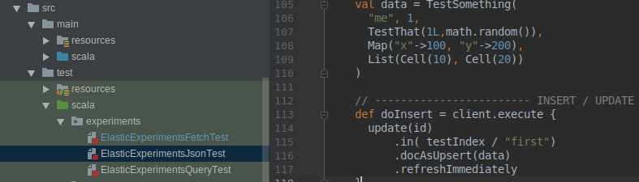
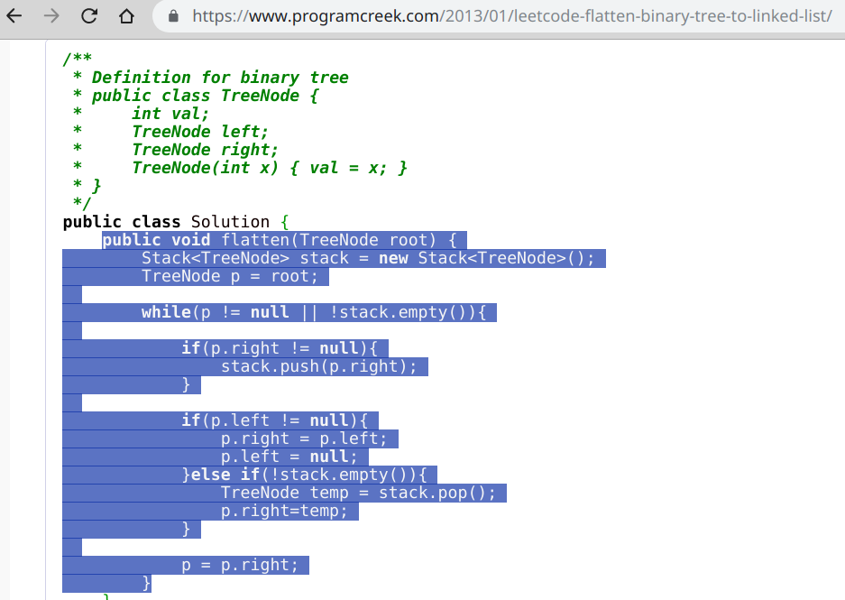
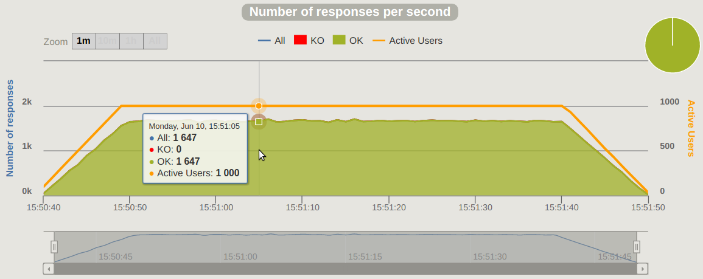

# Cultivons nos exemples !
_Démarrer vite, tester, apprendre, partager et recommencer !_

David CROSSON - twitter: [@crodav](https://twitter.com/crodav) - github : [dacr](https://github.com/dacr)

---

## Motivations

- **NON !**
  ```scala
  val RE = ("""(?m)(?i)^//\s+keywords\s*:\s+(.*)$""").r
  val input = 
      """// title: hello
        |// keywords: a, b, c
        |// scope: local""".stripMargin
  val keywords = { 
     RE.findFirstIn(input)
       .collect { case RE(value) => value.trim.split("[, ]+").toList }
       .getOrElse(Nil)
  }
  ```
  - test semi-unitaire manuel
    - mais il s'agit également d'une recette de cuisine

---

## Motivations

- **NEIN !**  
  
  - des TUs non applicatifs...

---

## Motivations

- **NO !**
  ```bash
  find . -name "*.java" -exec grep -i trucMucheFonction {} \;
  ```
  - J'ai déjà codé / mise en oeuvre ça, mais où ?

---

## Motivations

- **不 !** _(Bù)_
  

---

## Besoin

- Cultiver des **exemples de code**, et les 
  - maintenir
  - améliorer
  - partager
- Créer ses briques élémentaires de programmation
  - **hors projet**

---

## Des solutions

- npm + node
- pip + venv + python
- jshell
- [Ammonite](http://ammonite.io/) : Ma préférée !

---

## Ammonite 

- [Ammonite](http://ammonite.io/) en bref
  - Console ou Scripting
  - [Scala](https://www.scala-lang.org/)
  - **Chargement à chaud**
- Prérequis :
  - JVM >= 8
  - Installer **Ammonite** : http://ammonite.io/

---

## Live#1 - découverte...


... et modélisation des intentions

---

## Principes

- **Démarrer vite** : Ammonite
- **Apprendre** : REPL / scripts d'expérimentation
- **Tester/Capitaliser** : tests unitaires scriptés
- **Partager** : github, gitlab, blog, ...
- **Et recommencer**, en amélioration continue
  - afin d'enrichir sa base de connaissance

---

## Comment partager ?

- Via les 
  - gists de github
  - snippets de gitlab
- Facile car
  - 1 fichier = 1 exemple complet
    - **résolution/chargement à chaud**

---

## Live#2 - akka-http / selenium / gatling



---

## => Briques élémentaires

- serveur http minimaliste
- amorce de tests sélénium
- scénario de test de charge  simplifié

---

## Comment partager efficacement ?

- Multiplication des gists / snippets
  - pour quelques exemples c'est OK
- Partager un depot GIT unique ?
  - oui mais difficile de gérer finement les droits d'accès
- => Utiliser les APIs !

---

## Live#3

- Démarche itérative pour automatiser le partage des gists/snippets
  - requêtage HTTP
  - manips JSON
  - Mise en oeuvre de l'API
  - ...

---

## ... et ainsi de suite ...

- jusqu'à arriver au script complet,
  - **assemblage** de techniques, d'API
    - mise en oeuvre
      - dans une succession de gists / snippets
- => [gists-manage](https://gist.github.com/dacr/c525e743825ef10afe1e6bc72737554b)

---

## Pour conclure

- **Cultivez vos exemples !**
  - Construisez votre base de connaissance !
- N'ayez pas peur de partager votre code !
  - _Ajoutez des TODOs_ là ou votre code "smell"
  - **inner source** et/ou **open source**
- Une autre perspective intéressante :
  - jupyter (ammonite pour le support scala)

---

## Questions


---

## Sources

- [Tous mes gists](https://gist.github.com/dacr)
- **Les gists du live#1**
  - [hello](https://gist.github.com/dacr/803127034b6457fe2648e35fcc79acf1)
  - [pi-compute](https://gist.github.com/dacr/cb218633c2e872950a6f077be62d70f1)
- **Les gists du live#2**
  - [akka-http](https://gist.github.com/dacr/046bdee39a9ec3e513612a21d300677a)
  - [selenium](https://gist.github.com/dacr/8b01bb55d2a36c03f1ec096986ecb6ae)
  - [gatling](https://gist.github.com/dacr/a3c9c549b07a26a7d3d0ab8e89b5255b)
- **Les gists du live#3**
  - [sttp](https://gist.github.com/dacr/d7fc9d8f8607f0adebda553dfe185bff)
  - [json4s](https://gist.github.com/dacr/a3c6a53fbb6cd20a60a821af70635e99)
  - [sttp-json](https://gist.github.com/dacr/7a4dc5c4eafce54264e4f578df4334bb)
  - [gists-list](https://gist.github.com/dacr/5de34df6e63f0ec797ead103603aa278)
  - [gists-manage](https://gist.github.com/dacr/c525e743825ef10afe1e6bc72737554b)

---

## AlpesCraft Pitch

Nous allons vivre une approche itérative et apprenante du développement logiciel basé sur ammonite et scala.
Cette approche repose sur la création d'exemples très facilement exécutable et partageable via les gists de github
ou les snippets de gitlab.
Cette vidéo est un "reboot" de la présentation initialement intitulée "Démarrer vite, tester, apprendre, partager 
et recommencer !" et réalisée lors de la conférence Alpescraft le 13 juin 2019.

